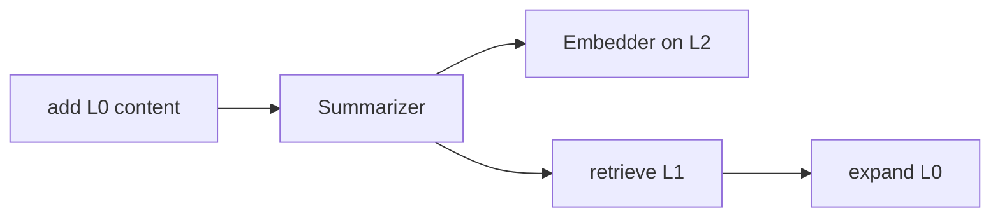

# Core concepts

ContextSeek is a **context asset layer** for agents: one write path (`add`), one ranked read path (`retrieve`), and optional evolution from raw observations to reusable skills.

The conceptual documentation is split into three focused pages:

| Page | What it covers |
|------|---------------|
| [ContextItem model](../concepts/context-model.md) | Object fields, Provenance, Links, why unified |
| [Scope & Stage](../concepts/scope-and-stage.md) | Isolation boundaries, maturity pipeline, stability |
| [Retrieval model](../concepts/retrieval-model.md) | L0/L1/L2 tiers, recall routes, reranking, filtering |

The rest of this page is a condensed reference for readers who want a quick overview in one place.

---

---

## Design goal: one object, three guarantees

Every record that enters ContextSeek should be:

| Guarantee | Question it answers | Mechanism |
|-----------|---------------------|-----------|
| **Retrievable** | Can we find this later under the right tenant/user? | Index on write; `retrieve()` with recall + rerank |
| **Traceable** | Can we explain why the agent saw this? | Mandatory `provenance`; `links`; audit APIs |
| **Evolvable** | Can experience compound over time? | `stage` pipeline; `compact()` / `dream()` |

If data has no identifiable source, must never be searched, or is throwaway buffer, keep it outside ContextSeek (Redis session cache, raw log files, etc.).

---

## ContextItem: the only core type

Memory snippets, KB articles, traces, and distilled skills are all **`ContextItem`** instances. The type does not change—**stage**, **provenance**, and **tags** express semantics.

```python
from contextseek import ContextSeek
from contextseek.domain.provenance import SourceType
from contextseek.domain.stages import Stage, Stability

ctx = ContextSeek.from_settings()

item = ctx.add(
    "Always run integration tests before production deploy.",
    scope="acme/platform/team-sre",
    source="runbook/deploy-v4",
    source_type=SourceType.document,
    tags=["deploy", "prod"],
    stage=Stage.knowledge,           # optional override
    stability=Stability.stable,      # optional override
)
```

### Field groups

**Identity**

| Field | Description |
|-------|-------------|
| `id` | Auto-generated hex id unless you manage ids yourself via low-level APIs |
| `scope` | Tenant/project/subject path (see below) |
| `content` | L0 payload: string or JSON-serializable dict |

**Retrievable surface**

| Field | Description |
|-------|-------------|
| `abstract` | L2 (~100 chars) — embedding input when summarizer runs |
| `summary` | L1 (~2k chars) — default text in `retrieve()` hits |
| `tags` | Filter dimensions; **all** listed tags must match when filtering |
| `embedding` | Vector of L2 (or L0 fallback) |
| `searchable` | `False` after archive/soft-delete |
| `relevance_boost` | Multiplier from positive `feedback()` |

**Traceable**

| Field | Description |
|-------|-------------|
| `provenance` | Required `Provenance` (source_type, source_id, confidence, …) |
| `links` | List of `Link` to other item ids |

**Evolvable**

| Field | Description |
|-------|-------------|
| `stage` | `raw` → `extracted` → `knowledge` → `skill` |
| `stability` | Retention/decay policy |

**Lifecycle (mostly system-managed)**

| Field | Description |
|-------|-------------|
| `created_at` / `updated_at` | UTC timestamps |
| `access_count` / `last_accessed_at` | Updated when item appears in `retrieve()` results |
| `superseded_by` | Id of newer item that replaced this one |
| `deleted_at` / `deleted_reason` | Soft delete metadata |

Access string body via `item.content_text` (empty when `content` is `None` after summary-only hits).

---

## Scope: your isolation boundary

Scopes are **path strings**, not SQL schemas:

```
{tenant}/{project}/{subject}
```

Examples:

| Scope | Meaning |
|-------|---------|
| `acme/checkout/user-42` | One shopper’s agent memory |
| `acme/platform/on-call` | Shared runbooks for the platform team |
| `demo_tenant/default/alice` | Tutorial data |

### Best practices

- Use **stable ids** in the last segment (`user-42`, `bot-7`), not display names that change.
- Put **shared** knowledge in a team scope; do not copy the same paragraph into thousands of user scopes.
- One logical agent session can still use one scope per user; rotate scope only when you intentionally want a clean slate.
- `retrieve(scope=...)` only searches that prefix. There is no built-in “search all tenants” — call multiple scopes or ingest into a shared scope via [DataPlugs](integrations/dataplugs.md).

### Anti-patterns

| Don't | Why |
|-------|-----|
| `scope="session-" + uuid` per message | Explodes storage; nothing compounds |
| Put secrets in `scope` | Scopes appear in logs and audit |
| Mix unrelated products in one scope | Retrieval noise and policy risk |

---

## Stage and stability

### Stage pipeline

```
raw  →  extracted  →  knowledge  →  skill
```

| Stage | Typical inputs | Default confidence weight in hits |
|-------|----------------|-----------------------------------|
| `raw` | Chat turns, tool JSON, fresh traces | 0.3 |
| `extracted` | Miner output, single-step insights | 0.6 |
| `knowledge` | Merged facts, validated runbooks | 0.85 |
| `skill` | Executable playbooks | 1.0 |

**Inference on write:** If you omit `stage`, ContextSeek infers from `source_type` and content shape. With `EVOLUTION_LLM_STAGE_INFER_ENABLED=true`, an LLM classifier may override heuristics.

**Evolution:** `compact()` promotes clusters (e.g. many `extracted` → one `knowledge`). `dream()` proposes cross-cluster hypotheses at idle time. Details: [Evolution](evolution.md).

### Stability

| Value | Meaning |
|-------|---------|
| `ephemeral` | Dies with the session/task |
| `transient` | Default for raw/extracted; normal decay |
| `stable` | Long-lived knowledge |
| `permanent` | Skills and critical policies; manual delete only |

Default stability per stage is defined in code (`STAGE_DEFAULT_STABILITY`).

---

## L0 / L1 / L2: token-aware retrieval

| Tier | Field | Agent sees by default? | Generated when |
|------|-------|------------------------|----------------|
| L0 | `content` | After `full=True` or `expand()` | Your `add()` payload |
| L1 | `summary` | Yes (`retrieve`, `layer=summary`) | Summarizer on `add()` |
| L2 | `abstract` | No (internal) | Summarizer on `add()` |



Without summarizer:

- L1 fields stay empty.
- `retrieve()` returns L0 in hits (`layer=full`).
- A one-time warning suggests enabling `SUMMARIZER_PROVIDER=llm`.

This is intentional: dev/test works without API keys; production should enable summarizer for cost control.

---

## Provenance

`Provenance` answers **where** data came from and **how much** to trust it.

| `source_type` | Default confidence (approx.) | Use when |
|---------------|------------------------------|----------|
| `human_input` | 1.0 | User typed or operator approved |
| `document` | 0.8 | Docs, wikis, tickets |
| `trace_extraction` | 0.5 | Parsed agent/run traces |
| `agent_inference` | 0.6 | Model-generated summary |
| `external_api` | 0.5 | Tool/API payload |
| `merge_result` | 0.7 | Evolution merge output |
| `distillation` | 0.7 | Bulk distill |
| `dream_consolidation` / `dream_divergence` | 0.4 / 0.3 | Dream engine |

Fields on `Provenance` (common):

- `source_id` — your stable key (URL, trace id, filename)
- `confidence` — 0.0–1.0, overridable at `add(..., confidence=0.9)`
- `verified` — human or external validation flag
- `context` — free-text note (“extracted from incident #4421”)

**Hard rule:** items without provenance must not be persisted. `add()` always constructs it.

---

## Links and evidence

`Link` connects items for audit and evolution:

| `LinkType` | Role |
|------------|------|
| `derived_from` | This row was extracted from another |
| `supported_by` | Corroboration |
| `refuted_by` | Contradiction (also used by conflict detector) |
| `supersedes` | Newer version replaces older |
| `merged_from` | Merge provenance |
| `distilled_into` | Point to skill item |
| `related_to` | Loose association |
| `requires` | Prerequisite |
| `synthesized_from` | Dream synthesis |

Example narrative:

```
knowledge: "Run integration tests before deploy"
  provenance.source_type = trace_extraction
  links:
    derived_from → raw trace of failed deploy
    supported_by → official deploy doc item
    supersedes → outdated checklist item
```

APIs: `upstream()`, `evidence_chain()`, `chain_confidence()` — [Provenance & audit](provenance-and-audit.md).

---

## Why not eight different “memory types”?

Earlier agent stacks often define separate types (profile, session, KB, trace, skill, …). ContextSeek collapses them because:

1. Integrators should not guess types at write time.
2. The same text may start as `raw` and become `knowledge` after evolution.
3. Retrieval, audit, and deletion policies apply uniformly.

Express intent with **`source_type`**, **`tags`**, and **`stage`**, not with different SDK classes.

---

## Mental model diagram

```
 Application                ContextSeek client
 ┌─────────────┐            ┌──────────────────────────┐
 │ Agent loop  │──add()────▶│ ContextItem + storage    │
 │             │◀─retrieve─│ Recall → rerank → L1/L0  │
 └─────────────┘            └───────────┬──────────────┘
                                        │
                         seekvfs adapters (memory/file/OceanBase/…)
```

---

## Next steps

| Topic | Doc |
|-------|-----|
| Full ContextItem field reference | [Context model](../concepts/context-model.md) |
| Scope design and Stage pipeline | [Scope & Stage](../concepts/scope-and-stage.md) |
| L0/L1/L2, recall routes, reranking | [Retrieval model](../concepts/retrieval-model.md) |
| Parameters & patterns | [Write & retrieve](write-and-retrieve.md) |
| `.env` | [Configuration](../getting-started/configuration.md) |
| Evidence APIs | [Provenance & audit](provenance-and-audit.md) |
| Backends | [Storage](storage.md) |
