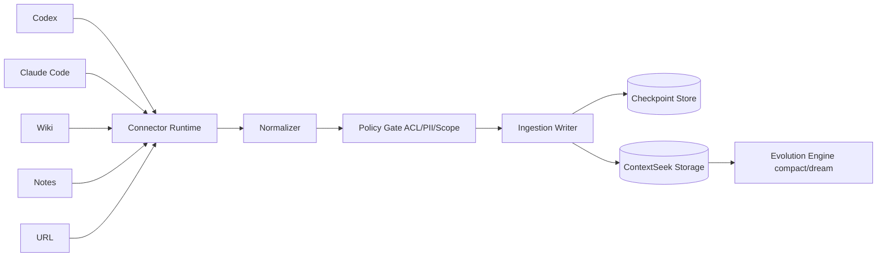
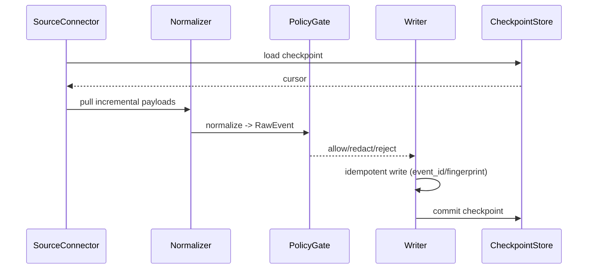

# ContextSeek 接入层 v1 设计方案

> 面向产品与工程协同的 v1 规格草案。目标是让用户继续使用已有工具（Codex / Claude Code / Wiki / Notes / URL），ContextSeek 在后台完成上下文接入、治理与演进。

---

## 1. 目标与范围

### 1.1 目标

- **无缝接入**：用户不迁移工作流，不更换原工具。
- **增量同步**：只处理新增/变更数据，避免高成本全量重扫。
- **统一治理**：所有来源落到统一对象模型（`ContextItem` + `Provenance` + `Link`）。
- **可演进**：接入后可进入 `raw -> extracted -> knowledge -> skill` 生命周期。
- **权限一致**：尽可能继承源系统 ACL，避免越权检索。

### 1.2 v1 范围

- 数据源：Codex、Claude Code、Wiki、Notes、URL
- 模式：`synced`、`direct`、`hybrid`
- 控制面：连接器管理、同步状态、checkpoint、错误重试
- 不含：中心化 Skill Registry、多租户跨组织共享

---

## 2. 设计原则

- **Source of truth in source systems**：源系统仍是事实来源，ContextSeek 负责语义化与可检索化。
- **Idempotent first**：重复投递不能重复写入，所有接入动作必须幂等。
- **Local-first for sensitive traces**：会话/代码轨迹默认本地优先。
- **Policy by default**：隐私与 ACL 不是后处理，而是写入前校验的一部分。
- **Observable ingestion**：每个连接器都必须可观测（延迟、失败率、积压、最近 checkpoint）。

---

## 3. 总体架构



### 3.1 核心组件

- **Connector Runtime**：负责拉取、调度、重试、并发控制。
- **Normalizer**：各来源字段映射到统一 `RawEvent`。
- **Policy Gate**：ACL 映射、脱敏、scope 校验、租户边界检查。
- **Ingestion Writer**：幂等写入 `ContextItem`，补齐 `Provenance/Link`。
- **Checkpoint Store**：记录每个连接器的增量游标和状态。

---

## 4. Connector 模式（v1）

| 模式 | 适用来源 | 数据策略 | 优点 | 风险 |
|---|---|---|---|---|
| `synced` | Wiki / Notes / URL | 增量拉取 + 落库存储 | 召回完整、可演进 | 有同步延迟 |
| `direct` | Codex / Claude Code 实时上下文 | 查询时直连，最小持久化 | 新鲜度最高 | 依赖源可用性 |
| `hybrid` | 高频聊天 + 长尾知识 | 历史索引 + 实时补拉 | 兼顾覆盖与时效 | 架构复杂度高 |

默认建议：
- 文档类（Wiki/Notes/URL）优先 `synced`
- 对话类优先 `hybrid`（历史入库 + 最近窗口 `direct`）

---

## 5. 统一数据模型（RawEvent v1）

```json
{
  "event_id": "uuid-or-deterministic-id",
  "source_type": "chat_trace | wiki_doc | note | url_doc",
  "source_id": "stable-primary-key",
  "scope": "org/project/user",
  "title": "optional",
  "content": "normalized text",
  "updated_at": "2026-06-11T15:00:00Z",
  "fingerprint": "sha256(content + structural-metadata)",
  "acl_principals": ["user:alice", "group:eng"],
  "metadata": {
    "connector_id": "wiki-main",
    "raw_type": "page",
    "version": "42"
  }
}
```

### 5.1 字段约束

- `source_id`：必须稳定且可重建（用于 update/replace）。
- `fingerprint`：用于跳过未变更内容。
- `updated_at`：用于增量游标推进，不可缺失。
- `scope`：写入前必须通过策略校验。

---

## 6. 同步与状态机

状态机定义：

`discovered -> queued -> fetching -> normalizing -> persisting -> checkpointing -> synced`

失败分支：

`fetching|normalizing|persisting -> failed -> queued(retry) -> dead_letter`

### 6.1 checkpoint 设计

- 粒度：`connector_id + source_partition`
- 结构建议：

```json
{
  "connector_id": "wiki-main",
  "partition": "space:eng",
  "cursor": "updated_at:2026-06-11T15:00:00Z",
  "last_success_at": "2026-06-11T15:01:30Z",
  "last_event_count": 128,
  "status": "synced"
}
```

### 6.2 重试策略

- 重试：指数退避（如 5s / 30s / 2m / 10m）
- 可重试错误：网络抖动、限流、临时鉴权失败
- 不可重试错误：schema 不合法、scope 非法、策略拒绝
- 连续失败阈值后进入 `dead_letter` 并告警

---

## 7. 权限与隐私模型

### 7.1 ACL 继承

- 优先继承源系统 ACL 到 `acl_principals`
- 检索时执行：`scope match AND principal match`
- ACL 缺失时：默认私有（仅 connector owner / admin 可见）

### 7.2 脱敏策略（写入前）

- 密钥模式：API Key、Token、Secret 规则清洗
- PII：邮箱/手机号等按策略脱敏或拒绝写入
- 代码路径与主机信息：按租户策略保留或掩码

### 7.3 审计

每次接入写入审计字段：
- `connector_id`
- `checkpoint`
- `policy_version`
- `decision`（allow/redact/reject）

---

## 8. 五类来源接入规范（v1）

## 8.1 Codex

- 采集对象：会话轮次、工具调用、命令结果、错误修复链
- 接入方式：hook + transcript 增量读取（offset）
- checkpoint：`session_id + turn_id + byte_offset`
- stage 建议：先写 `raw`，由 compact 抽取到 `extracted`

## 8.2 Claude Code

- 采集对象：prompt/response、文件变更摘要、终端执行结果
- 接入方式：hook + transcript 增量读取
- checkpoint：`session_id + turn_id + byte_offset`
- 特别要求：本地优先存储，默认启用敏感信息清洗

## 8.3 Wiki

- 采集对象：页面正文、评论、附件元数据、版本信息
- 接入方式：webhook（近实时）+ 定时 reconciliation（防漏）
- checkpoint：`space/page_id/version/updated_at`
- stage 建议：高可信页面可直接 `knowledge`

## 8.4 Notes

- 采集对象：Markdown 块、frontmatter、代码块、标签
- 接入方式：文件监听 + 可选 git hook
- checkpoint：`file_path + mtime + block_anchor`
- stage 建议：默认 `extracted`

## 8.5 URL

- 采集对象：正文、标题、发布时间、canonical 链接
- 接入方式：手动触发抓取 + 周期刷新（etag/last-modified）
- checkpoint：`canonical_url + etag_or_last_modified`
- stage 建议：`raw` 起步，后续抽取到 `extracted/knowledge`

---

## 9. 控制面 API（建议）

| API | 说明 |
|---|---|
| `POST /connectors` | 创建连接器与认证配置 |
| `GET /connectors` | 列出连接器状态、延迟、失败统计 |
| `POST /connectors/{id}/sync` | 触发即时增量同步 |
| `POST /connectors/{id}/pause` | 暂停连接器 |
| `POST /connectors/{id}/resume` | 恢复连接器 |
| `GET /connectors/{id}/checkpoints` | 读取游标与最近成功信息 |
| `GET /connectors/{id}/events` | 查看规范化事件与错误样本 |

---

## 10. 实现设计（工程落地）

本章给出 v1 的参考实现形态，目标是让方案可以直接拆分为开发任务。

### 10.1 建议目录结构

```text
src/contextseek/ingestion/
  __init__.py
  models.py                # RawEvent / Checkpoint / ConnectorConfig
  runtime.py               # ConnectorRuntime: 调度与并发
  scheduler.py             # 定时任务、退避重试
  checkpoints.py           # CheckpointStore 抽象 + 实现
  dead_letter.py           # 失败事件存储与重放
  normalizers/
    base.py
    codex.py
    claude_code.py
    wiki.py
    notes.py
    url.py
  connectors/
    base.py
    codex.py
    claude_code.py
    wiki.py
    notes.py
    url.py
  policy/
    gate.py                # ACL/PII/scope 校验
    redaction.py
  writer.py                # 幂等写入 ContextSeek
```

### 10.2 核心接口定义（建议）

```python
from dataclasses import dataclass
from typing import Iterable, Protocol

@dataclass
class RawEvent:
    event_id: str
    source_type: str
    source_id: str
    scope: str
    content: str
    updated_at: str
    fingerprint: str
    metadata: dict
    acl_principals: list[str] | None = None
    title: str | None = None


@dataclass
class SyncCheckpoint:
    connector_id: str
    partition: str
    cursor: str
    last_success_at: str | None = None
    status: str = "queued"


class SourceConnector(Protocol):
    def discover(self) -> list[str]: ...
    def pull(self, partition: str, checkpoint: SyncCheckpoint | None) -> Iterable[dict]: ...


class EventNormalizer(Protocol):
    def normalize(self, payload: dict, *, connector_id: str, partition: str) -> RawEvent: ...


class PolicyGate(Protocol):
    def apply(self, event: RawEvent) -> RawEvent | None: ...


class CheckpointStore(Protocol):
    def load(self, connector_id: str, partition: str) -> SyncCheckpoint | None: ...
    def save(self, checkpoint: SyncCheckpoint) -> None: ...
```

### 10.3 写入路径（Runtime 流程）



### 10.4 幂等与去重细则

- 优先键：`event_id`（同一事件重复投递直接跳过）
- 次级键：`source_id + fingerprint`（内容未变更跳过）
- 更新语义：`source_id` 相同且 `fingerprint` 不同，写入新版本并打 `supersedes` link
- checkpoint 提交时机：**仅在写入成功后**提交，避免“游标前移但数据丢失”

### 10.5 存储表结构建议（v1）

> 可落在现有后端（file/sqlite/ob）。以下为逻辑表结构，具体 DDL 按后端实现。

#### `ingestion_connectors`

| 字段 | 类型 | 说明 |
|---|---|---|
| `connector_id` | string(pk) | 连接器唯一 ID |
| `kind` | string | `codex/claude/wiki/notes/url` |
| `mode` | string | `synced/direct/hybrid` |
| `config_json` | json | 脱敏后配置 |
| `enabled` | bool | 是否启用 |
| `created_at` | timestamp | 创建时间 |
| `updated_at` | timestamp | 更新时间 |

#### `ingestion_checkpoints`

| 字段 | 类型 | 说明 |
|---|---|---|
| `connector_id` | string | 连接器 ID |
| `partition` | string | 分区键（space/channel/path） |
| `cursor` | string | 游标 |
| `status` | string | `queued/synced/failed` |
| `last_success_at` | timestamp | 最近成功 |
| `last_error` | string | 最近错误摘要 |
| `retry_count` | int | 连续重试次数 |

复合主键：`(connector_id, partition)`。

#### `ingestion_dead_letters`

| 字段 | 类型 | 说明 |
|---|---|---|
| `id` | string(pk) | 记录 ID |
| `connector_id` | string | 来源连接器 |
| `partition` | string | 来源分区 |
| `stage` | string | `fetch/normalize/persist` |
| `payload_json` | json | 原始失败载荷 |
| `error_type` | string | 错误类型 |
| `error_message` | string | 错误信息 |
| `created_at` | timestamp | 写入时间 |

### 10.6 调度与并发策略

- 调度粒度：`connector_id + partition`
- 建议并发：
  - 文档类 connector：每 connector 2~4 并发
  - 会话类 connector：每 connector 4~8 并发（小批量）
- 批次建议：
  - `pull_batch_size`: 50~200
  - `write_batch_size`: 20~100（避免单批失败影响过大）
- 背压策略：
  - 当 `dead_letter_rate` 或 `error_rate` 超阈值时自动降并发
  - 当 `checkpoint_age_seconds` 超阈值时触发优先级提升

### 10.7 Connector Runtime 伪代码

```python
def run_partition(connector_id: str, partition: str) -> None:
    cp = checkpoint_store.load(connector_id, partition)
    connector = connector_registry.get(connector_id)
    normalizer = normalizer_registry.get(connector_id)

    for payload in connector.pull(partition, cp):
        try:
            event = normalizer.normalize(payload, connector_id=connector_id, partition=partition)
            event = policy_gate.apply(event)
            if event is None:
                continue  # rejected by policy
            writer.write(event)  # idempotent
            cp = cp_next(cp, event.updated_at)
            checkpoint_store.save(cp)
        except RetryableError as exc:
            scheduler.requeue(connector_id, partition, exc)
            return
        except Exception as exc:
            dead_letter_store.put(connector_id, partition, payload, exc)
```

### 10.8 与现有 ContextSeek 的集成点

- `writer.py` 最终调用 `ContextSeek.add(...)` / `ctx.plug(...)` 路径
- `metadata` 内统一注入：
  - `connector_id`
  - `connector_kind`
  - `ingested_at`
  - `policy_decision`
- 高可信 Wiki 可通过 metadata 建议 stage，交由现有策略最终裁决

### 10.9 测试策略

- **单元测试**
  - connector pull 游标推进正确
  - normalizer 字段映射完整性
  - policy gate 的 allow/redact/reject 分支
  - writer 幂等语义（重复事件不重复写）
- **集成测试**
  - Notes 文件变更 -> 检索可见（端到端）
  - Wiki webhook + pull 防漏验证
  - transcript 增量读取在重启后可续传
- **回归测试**
  - checkpoint 损坏恢复
  - 大批量失败后的 dead-letter 重放
  - ACL 缺失时默认私有策略

### 10.10 发布与迁移步骤（建议）

1. `feature flag` 默认关闭：`INGESTION_V1_ENABLED=false`
2. 先灰度 Notes/URL 两类低风险 connector
3. 指标稳定后上线 Wiki，再上线会话 connector
4. 通过 `checkpoint_age_seconds` 与 `error_rate` 评估是否扩容
5. 达标后默认开启 `INGESTION_V1_ENABLED=true`

---

## 11. 与演进层的契约

接入层对演进层的保证：

- 所有写入条目可追溯（`source_id`、`provenance` 完整）
- 去重语义稳定（`fingerprint` + 幂等写入）
- 连接器标签完整（`from:codex` / `from:wiki` 等）
- 可按来源分片执行 `compact()` / `dream()`

演进层回流信号：

- `feedback()` 高分条目用于提升来源质量权重
- 低质量来源触发 connector 策略调整（采样率、抓取范围、过滤）

---

## 12. 可观测性与 SLO（v1）

### 11.1 核心指标

- `ingestion_events_total{connector_id,status}`
- `ingestion_lag_seconds{connector_id}`
- `checkpoint_age_seconds{connector_id}`
- `dead_letter_events_total{connector_id}`
- `acl_missing_ratio{connector_id}`

### 11.2 建议 SLO

- 文档类连接器（Wiki/Notes/URL）：P95 同步延迟 < 10 分钟
- 会话类连接器（Codex/Claude）：P95 同步延迟 < 60 秒（hook 路径）
- 失败恢复：95% 临时错误在 15 分钟内自动恢复

---

## 13. 里程碑（6 周）

- **W1**：Connector runtime、checkpoint store、幂等写入核心
- **W2**：Notes + URL 连接器上线
- **W3**：Wiki 连接器（webhook + pull）与 ACL v1
- **W4**：Codex / Claude Code transcript 连接器 + hook SDK
- **W5**：hybrid 查询路径（历史索引 + 实时补拉）
- **W6**：连接器控制台、告警、dead-letter 运维工具

---

## 14. v1 非目标

- 不提供中心化公共 Skill Registry
- 不做跨租户共享与联邦治理
- 不做通用爬虫平台（仅 URL connector 的受控抓取）
- 不做复杂人工冲突解决 UI

---

## 15. 风险与缓解

- **源 API 变更/限流**：抽象 provider adapter + 退避重试 + 速率预算
- **权限漂移**：周期 ACL 重建 + 检索侧强校验
- **数据陈旧**：incremental + reconciliation 双轨
- **重复/脏数据**：fingerprint 去重 + schema 校验 + dead-letter
- **隐私风险**：默认脱敏 + 可审计拒绝策略

---

## 16. 落地建议（先后顺序）

1. 先做 `synced` 文档类（Wiki/Notes/URL）打稳数据底座  
2. 再做 Codex/Claude transcript 接入，打通经验沉淀  
3. 最后补 `hybrid` 与控制面，形成“可运营接入层”

---

## 17. 相关文档

- [DataPlug（数据源）](dataplugs.md)
- [MCP / HTTP / CLI](mcp-http-cli.md)
- [上下文演进](../evolution.md)
- [溯源与审计](../provenance-and-audit.md)
